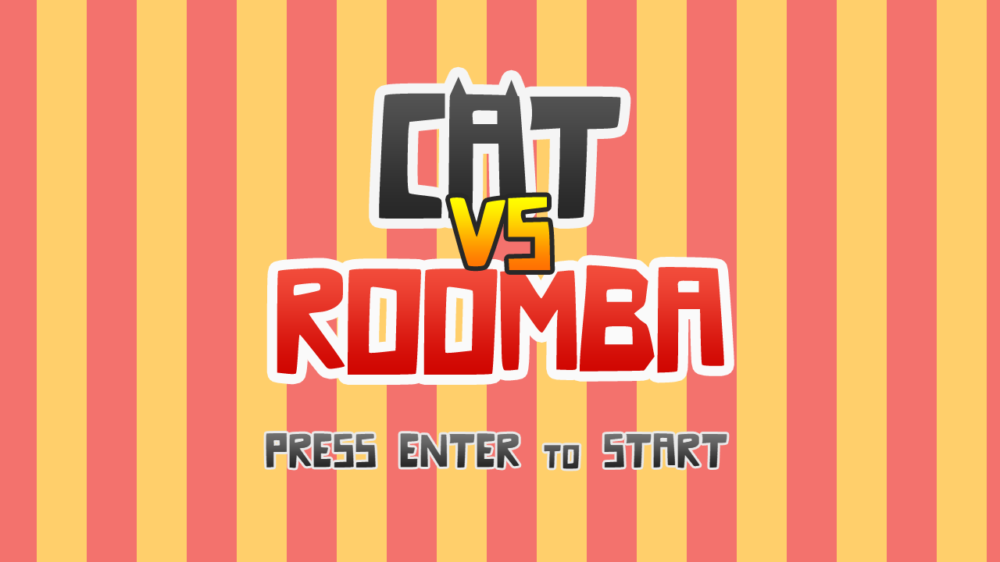

## Cat vs Roomba

### Description

Ah! Home, sweet home! Time for some automatic cleaning... if the worst enemy of Roomba allows it... be careful with Cat!

### Features

 - Two players: Cat and Roomba

### Controls

Keyboard:
 - A-W-S-D -> Move the Roomba and clean the room.
 - SPACE -> Play Roomba sound.
 
Mouse:
 - Mouse move -> Control Cat movement, click on destination to go there.
 - Mouse right button -> Play Cat sound.

### License

Game sources are licensed under an unmodified zlib/libpng license, which is an OSI-certified, BSD-like license that allows static linking with closed source software. Check [LICENSE](LICENSE) for further details.

*Copyright (c) 2014-2024 Ramon Santamaria ([@raysan5](https://github.com/raysan5))*