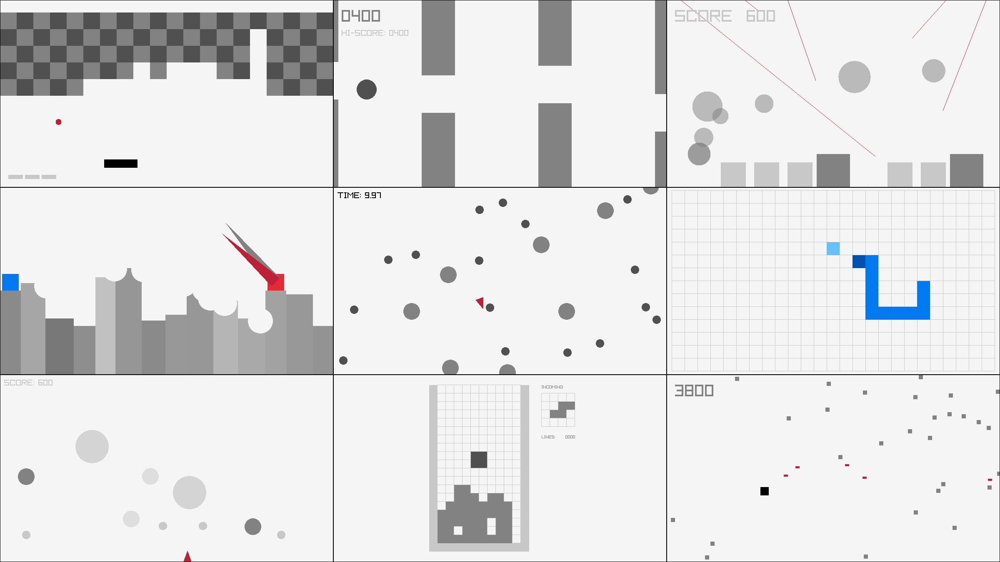

## Classic Games

### Description

Classic games collection implemented using raylib

### Features

 - TODO.

### Controls

Keyboard:
 - ENTER -> Start the game/Action.
 - SPACE -> Game action (if any).
 - UP-DOWN-LEFT-RIGHT -> Move the player.

### License

Game sources are licensed under an unmodified zlib/libpng license, which is an OSI-certified, BSD-like license that allows static linking with closed source software. Check [LICENSE](LICENSE) for further details.

*Copyright (c) 2014-2024 Ramon Santamaria ([@raysan5](https://twitter.com/raysan5))*