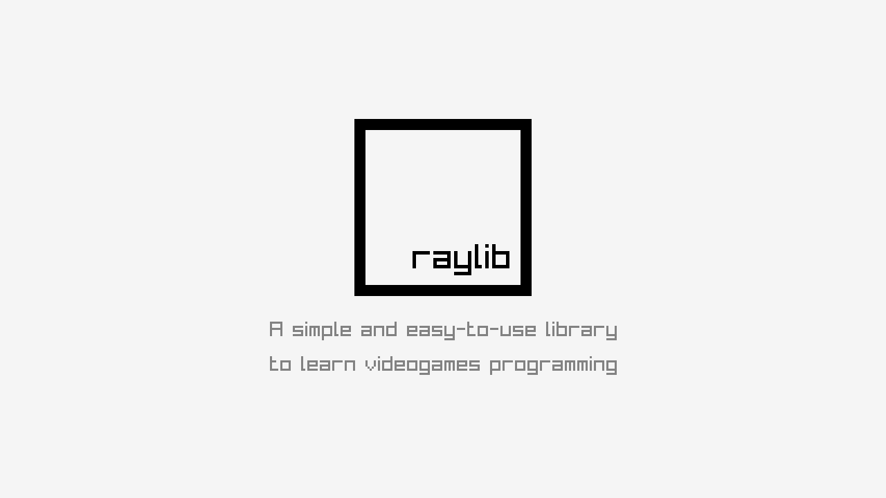

## JUST DO

### Description

Experimental puzzle game! Try to find a logic solution to multiple illogic situations.

### Features

 - TODO.

### Controls

Mouse:
 - Mouse move -> Selec shapes to click on
 - Mouse right button -> Click on shapes

### License

Game sources are licensed under an unmodified zlib/libpng license, which is an OSI-certified, BSD-like license that allows static linking with closed source software. Check [LICENSE](LICENSE) for further details.

*Copyright (c) 2014-2022 Ramon Santamaria ([@raysan5](https://twitter.com/raysan5))*