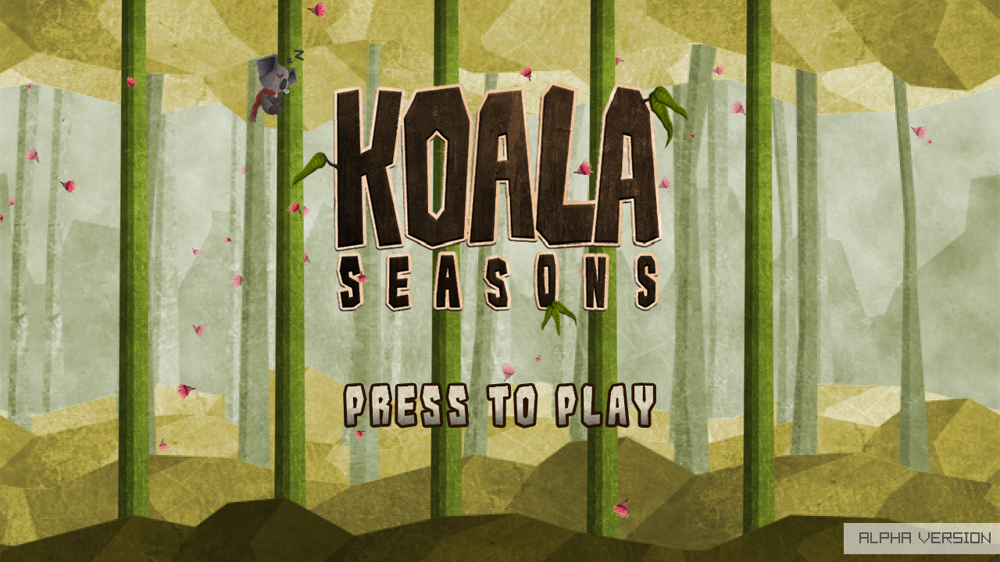

## Koala Seasons

### Description

Fight the elements! Fight your enemies! Save the world! How long will you survive?

This game was originally created by [emegeme](https://www.emegeme.com/) to be used as a benchmark test for raylib on Android devices.

### Features

 - TODO.

### Controls

Keyboard:
 - SPACE -> Jump to next tree.
 - DOWN -> Slide down the tree.
 
### Developers

 - Ramon Santamaria (@raysan5) - Code Review and Game Design
 - Daniel Gomez - Art (Characters and Backgrounds) and Game Design
 - Daniel Moreno - Programming and Game Design
 - Marc Agüera - Programming and Game Design

### License

Game sources are licensed under an unmodified zlib/libpng license, which is an OSI-certified, BSD-like license that allows static linking with closed source software. Check [LICENSE](LICENSE) for further details.

*Copyright (c) 2014-2024 Ramon Santamaria ([@raysan5](https://github.com/raysan5))*