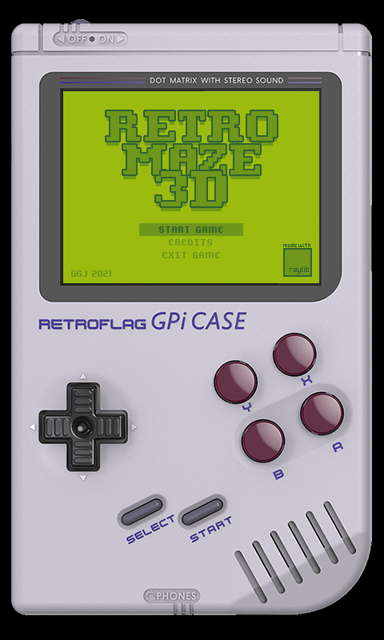

## RETRO MAZE 3D

### Description

A new old-school game with retro-style graphics! Try to escape for the maze in the given time! No time to lose!

This game has been developed to run on the GPi CASE with a Raspberry Pi Zero.
More info: http://retroflag.com/GPi-CASE.html

### Features

 - TODO.

### Controls

On Windows:
 - ENTER to select
 - Move player with WASD and LEFT/RIGHT cursors
 - SPACE for game pause
 - V for lost voice message
 - M key for minimap
 - G key for GPi CASE frontend

On GPi CASE:
 - DPAD + A button to select menu options
 - DPAD and L-R TRIGGERS to move player 
 - START for game pause
 - SELECT to show minimap
 - X button for lost voice message

### License

Game sources are licensed under an unmodified zlib/libpng license, which is an OSI-certified, BSD-like license that allows static linking with closed source software. Check [LICENSE](LICENSE) for further details.

*Copyright (c) 2014-2021 Ramon Santamaria ([@raysan5](https://twitter.com/raysan5))*